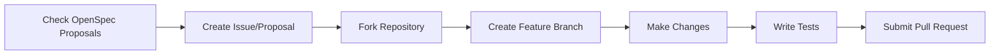

# Incrementum

<div align="center">

**Incremental Reading + Spaced Repetition = Knowledge Retention**

[]()
[]()
[]()
[]()
[]()

[Features](#-features) • [Demo](https://readsync.org) • [Installation](#-installation) • [Quick Start](#-quick-start) • [Documentation](#-documentation) • [Contributing](#-contributing)

</div>

---

## Overview

**Incrementum** is a sophisticated desktop application that combines **incremental reading** with **spaced repetition** to help you efficiently process and retain information from large volumes of content.

Built with modern technologies—Tauri, React, and Rust—it offers a beautiful, fast, and cross-platform learning environment that adapts to your needs.

### Core Philosophy

| Principle | Description |
|-----------|-------------|
| **Incremental Reading** | Process large documents in small, manageable chunks over time |
| **Spaced Repetition** | Review content at scientifically-optimized intervals using FSRS-5 |
| **Import Flexibility** | Bring content from anywhere—PDFs, EPUBs, websites, papers, Anki decks |
| **Smart Scheduling** | Know exactly when you'll review each card again with preview intervals |
| **Rich Analytics** | Track your progress, streaks, and performance metrics |

---

## ✨ Features

### 📚 Document Management

```
Multi-Format Import
├── PDF, EPUB, Markdown, HTML, TXT, JSON
├── URL scraping & content extraction
├── Screenshot capture
└── Research paper import (Arxiv)
```

**Smart Processing**
- Auto-segmentation into manageable sections
- Metadata extraction (word count, reading time, complexity)
- Keyword extraction and categorization
- Batch processing support

**Migration Tools**
- Anki package import (.apkg)
- SuperMemo import (ZIP exports)

---

### 🧠 Learning & Review

**FSRS-5 Algorithm**
- State-of-the-art spaced repetition scheduler
- 90% retention rate optimization
- Preview intervals for all rating options
- Alternative SM-2 algorithm available

**Review Experience**
- Multiple card types: Flashcards, Cloze, Q&A, Basic
- Full keyboard shortcuts (Space, 1-4)
- Session statistics tracking
- Virtual scrolling for 10,000+ cards

**Queue Management**
- Advanced filtering (type, state, tags, category)
- Smart sorting (due date, priority, difficulty)
- Bulk operations (suspend, delete, postpone)
- Export to CSV/JSON

---

### 📊 Analytics & Insights

| Metric | Description |
|--------|-------------|
| **Dashboard Stats** | Cards due, total learned, retention rate |
| **Memory Statistics** | Mature, young, and new card breakdown |
| **FSRS Metrics** | Stability and difficulty tracking |
| **Activity Charts** | 30-day review history visualization |
| **Study Streaks** | Current and longest streak tracking |
| **Goals Progress** | Daily/weekly target monitoring |
| **Category Breakdown** | Performance by subject area |

---

### 🎨 User Experience

**Themes**
- 17 built-in themes (6 dark, 11 light)
- Live theme preview
- Custom theme creation & editing
- Import/export themes

**Performance**
- Startup time: <500ms
- Review submission: <50ms
- Queue loading: <100ms
- Smooth 60fps animations

**Accessibility**
- Responsive design (all screen sizes)
- Full keyboard navigation
- High contrast support

---

### 🔧 Advanced Features

<details>
<summary><b>Integrations</b> <em>(click to expand)</em></summary>

- **Cloud Sync**: Dropbox, Google Drive, OneDrive
- **Browser Extension**: Web-based learning integration
- **RSS Reader**: Learn from your favorite feeds
- **YouTube**: Import videos with transcripts
- **Podcast Support**: Audio learning with transcripts
</details>

<details>
<summary><b>AI & Automation</b> <em>(click to expand)</em></summary>

- **OCR Support**: Extract text from images
- **AI Flashcard Generation**: Automatic card creation with LLMs
- **Auto-Summarization**: Generate document summaries
- **Smart Scheduling**: Automated review sessions
</details>

<details>
<summary><b>Data Management</b> <em>(click to expand)</em></summary>

- **Backup & Restore**: Full data portability
- **Export Options**: CSV, JSON, Anki formats
- **Migration Tools**: Import from other SRS apps
- **Data Validation**: Integrity checks and repairs
</details>

---

## 🚀 Installation

### Prerequisites

- **Node.js** 18+ and npm
- **Rust** toolchain (1.70+)
- **System dependencies** for your platform

#### Linux (Ubuntu/Debian)

```bash
sudo apt update
sudo apt install libwebkit2gtk-4.1-dev \
    build-essential \
    curl \
    wget \
    file \
    libxdo-dev \
    libssl-dev \
    libayatana-appindicator3-dev \
    librsvg2-dev
```

#### macOS

```bash
xcode-select --install
```

#### macOS Security: Opening Self-Signed Applications

When you first run Incrementum on macOS, you may encounter a security warning since the application is self-signed. This is normal for unsigned apps. Here's how to proceed:

**Method 1: Open via Finder (Recommended)**

1. In Finder, locate the `Incrementum.app`
2. Right-click (or Control-click) the app → Open
3. A security warning dialog will appear
4. Click "Open" again to confirm

The right-click → Open path adds a security exception for that application.

**Method 2: Allow via System Settings**

1. Try to open the app normally (double-click). It will fail with a security warning
2. Open System Settings → Privacy & Security
3. Scroll down to the security section
4. Look for a message saying "Incrementum was blocked from use because it is not from an identified developer"
5. Click "Open Anyway" and confirm with "Open" in the dialog

After following either method, macOS will remember your choice, and you can open the app normally in the future.

#### Windows

No additional dependencies required.

### Build from Source

```bash
# Clone the repository
git clone https://github.com/melpomenex/incrementum-tauri.git
cd incrementum-tauri

# Install dependencies
npm install

# Run development server
npm run tauri:dev

# Build for production
npm run tauri:build
```

The production bundle will be in `src-tauri/target/release/bundle/`.

### Download Pre-built Binaries

Visit the [Releases](https://github.com/melpomenex/incrementum-tauri/releases) page to download pre-built binaries for your platform.

---

## 🎯 Quick Start

### Step 1: Import Your First Document

```
Documents → Import Document → Choose source
```

| Source | Description |
|--------|-------------|
| 📁 **Local Files** | Select PDF, EPUB, or text files from your computer |
| 🌐 **URL** | Enter any web URL to fetch and process content |
| 📄 **Arxiv** | Paste Arxiv ID or URL for research papers |
| 📸 **Screenshot** | Capture your screen directly |
| 🃏 **Anki** | Import .apkg files from Anki |
| 📦 **SuperMemo** | Import ZIP exports from SuperMemo |

---

### Step 2: Process Content

Documents are automatically **segmented** and **extracts** are created.

- Review extracts in the **Extracts** tab
- Edit, categorize, and tag them
- Convert them to learning items (Flashcards)

---

### Step 3: Start Reviewing

```
Review → See due cards → Rate your recall (1-4)
```

**Rating Scale**

| Rating | Label | Description | Next Review |
|--------|-------|-------------|-------------|
| 1 | 🔴 Again | Forgot completely | ~10 minutes |
| 2 | 🟡 Hard | Remembered with difficulty | ~1-2 days |
| 3 | 🟢 Good | Remembered easily | ~5-7 days |
| 4 | 🔵 Easy | Too easy | ~10-14 days |

> **Preview Intervals**: See exactly when each card will appear next before you rate!

---

### Step 4: Track Progress

```
Analytics → View stats, charts, and streaks
```

---

## 📖 Documentation

### User Documentation

| Document | Description |
|----------|-------------|
| [Feature Overview](docs/FEATURES_IMPLEMENTED.md) | Complete feature list and implementation status |
| [Installation Guide](docs/INSTALL.md) | Detailed setup instructions |
| [OCR Features](docs/OCR_FEATURES.md) | Text extraction from images |

### Developer Documentation

| Document | Description |
|----------|-------------|
| [Project Summary](docs/PROJECT_SUMMARY.md) | Architecture and technical details |
| [Implementation Status](docs/IMPLEMENTATION_STATUS.md) | Current progress and roadmap |
| [OpenSpec Workflow](openspec/AGENTS.md) | Contribution guide and proposal process |

---

## 🛠️ Development

### Project Structure

```
incrementum-tauri/
├── src/                    # Frontend (React + TypeScript)
│   ├── components/         # UI components
│   ├── pages/             # Page components
│   ├── stores/            # Zustand state management
│   ├── api/               # Tauri command wrappers
│   ├── themes/            # Theme definitions
│   └── utils/             # Utility functions
├── src-tauri/             # Backend (Rust)
│   ├── src/
│   │   ├── commands/      # Tauri command handlers
│   │   ├── models/        # Data models
│   │   ├── database/      # SQLite database layer
│   │   ├── algorithms/    # FSRS, SM-2 implementations
│   │   ├── processor/     # Document processors
│   │   └── integrations/  # External integrations
│   └── Cargo.toml         # Rust dependencies
└── package.json           # Node.js dependencies
```

### Available Scripts

| Command | Description |
|---------|-------------|
| `npm run tauri:dev` | Start development server |
| `npm run dev` | Web-only development server |
| `npm run tauri:build` | Build production application |
| `npm run build` | Build web frontend only |
| `npm run test` | Run test suite |
| `npm run test:ui` | Launch test UI |
| `npm run test:coverage` | Generate coverage report |
| `npm run tauri:build:linux` | Build for Linux |
| `npm run tauri:build:macos` | Build for macOS |
| `npm run tauri:build:windows` | Build for Windows |

---

### Tech Stack

<details>
<summary><b>Frontend</b></summary>

- **Framework**: React 19 with TypeScript
- **State Management**: Zustand
- **Styling**: Tailwind CSS
- **Build Tool**: Vite
- **Icons**: Lucide React

</details>

<details>
<summary><b>Backend</b></summary>

- **Framework**: Tauri 2.0
- **Language**: Rust
- **Database**: SQLite with SQLx
- **Algorithm**: FSRS-5 (spaced repetition)
- **Runtime**: Tokio (async)

</details>

<details>
<summary><b>Key Libraries</b></summary>

- **React Query**: Data fetching and caching
- **React Router**: Client-side routing
- **Recharts**: Analytics visualizations
- **EPUB.js**: EPUB parsing
- **PDF.js**: PDF rendering
- **Three.js**: 3D visualizations

</details>

---

## 🤝 Contributing

We welcome contributions! Please see our [Contributing Guide](CONTRIBUTING.md) for details.

### Development Workflow



1. **Check** [OpenSpec proposals](openspec/changes/) for planned features
2. **Create** an issue or proposal for new features
3. **Fork** the repository
4. **Create** a feature branch (`git checkout -b feature/amazing-feature`)
5. **Make** your changes
6. **Write** tests if applicable
7. **Submit** a pull request

### Code Style Guidelines

| Language | Tool | Guidelines |
|----------|------|------------|
| **Rust** | `cargo fmt` | Follow Rust naming conventions |
| **TypeScript** | Prettier | Functional components, proper typing |
| **General** | - | Self-documenting code, comment complex logic |

---

## 📊 Performance Benchmarks

| Operation | Time | Notes |
|-----------|------|-------|
| **Startup** | <500ms | Cold start |
| **Queue Loading** | <100ms | 10,000+ cards |
| **Review Submission** | <50ms | Database write |
| **Preview Intervals** | <20ms | FSRS calculation |
| **Analytics Dashboard** | <200ms | All charts loaded |
| **Document Import** | <2s* | Varies by file size |

*Average PDF/EPUB, processing time included

---

## 📝 License

Apache 2.0 License - see [LICENSE](LICENSE) for details.

## 🙏 Acknowledgments

| Project | Contribution |
|---------|--------------|
| **[FSRS](https://github.com/open-spaced-repetition/fsrs4anki)** | Excellent spaced repetition algorithm |
| **[Tauri](https://tauri.app/)** | Amazing desktop framework |
| **[Open Spaced Repetition](https://github.com/open-spaced-repetition)** | Research and insights |

---

<div align="center">

### **Built with ❤️ using Tauri + React + Rust**

[](https://readsync.org)
[](docs/)
[](https://github.com/melpomenex/incrementum-tauri/issues)
[](CHANGELOG.md)

**[⬆ Back to Top](#incrementum)**

</div>
